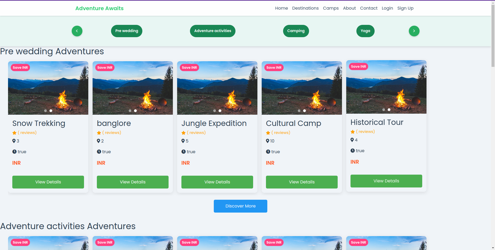

# Rails Application with PostgreSQL, Twilio, Razorpay, ActiveAdmin, and Devise

Scrrenshots : 

This Rails application integrates several key technologies and services:

- Database: PostgreSQL on AWS
- Messaging: Twilio
- Payment Gateway: Razorpay
- Admin Interface: ActiveAdmin
- Authentication: Devise

## Prerequisites

- Ruby (version X.X.X)
- Rails (version X.X.X)
- PostgreSQL
- AWS account
- Twilio account
- Razorpay account

## Setup

1. Clone the repository:

2. Install dependencies:

3. Set up environment variables:
Create a `.env` file in the root directory and add the following:

DATABASE_URL=your_postgresql_connection_string
TWILIO_ACCOUNT_SID=your_twilio_account_sid
TWILIO_AUTH_TOKEN=your_twilio_auth_token
RAZORPAY_KEY_ID=your_razorpay_key_id
RAZORPAY_KEY_SECRET=your_razorpay_key_secret

4. Set up the database:

rails db:create
rails db:migrate

5. Start the server:

rails server

## Features

- User authentication with Devise
- Admin interface using ActiveAdmin
- SMS messaging capabilities via Twilio
- Payment processing with Razorpay
- [Add any other key features of your application]

## Configuration

### Database
The application uses PostgreSQL hosted on AWS. Ensure your `config/database.yml` is properly configured.

### Twilio
Twilio is used for messaging. Configure your Twilio credentials in the `.env` file.

### Razorpay
Razorpay is integrated for payment processing. Set up your Razorpay credentials in the `.env` file.

### ActiveAdmin
ActiveAdmin provides an administration framework. Access the admin interface at `/admin`.

### Devise
Devise is used for user authentication. Customize Devise settings in `config/initializers/devise.rb`.

## Deployment

[Add instructions for deploying your application]

## Contributing

[Add guidelines for contributing to your project]

## License

[Specify the license for your project]

